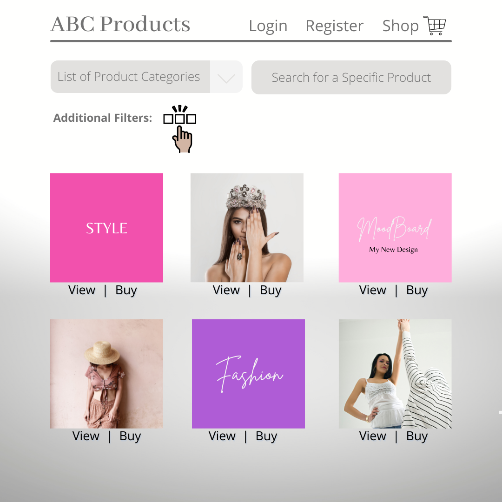

# 🏬 ABC Products

ABC Products is an E-Commerce single page web application that enables customers to buy a variety of products online and shipped anywhere in the continental United States.
  

## 💻 Developers

* [Anjeh Mbah](https://github.com/Anjeh24)
* [Bruno Calderon](https://github.com/bruno192000)
* [Carla Kinley-Davis](https://github.com/ckinleydavis)
  

## 🎯 Objectives

* Use the MERN Stack: **MongoDB (NoSQL)**, **GraphQL API**, **Express.js**, **React.js**, **Node.js**, and **user authentication with JWT**.
* Integrate the web application with a variety of frameworks and APIs.
* Leverage **GitHub** and **Heroku**.
<!-- * Algorithmic development using T-SQL (**MS SQL Server**) and **JavaScript**. -->
* Provide Continuous Delivery of projects deployed to production.
  

## 📚 _User Stories_
As a Customer I want to . . . | So that I may . . .
----------------------------- | -----------------------------
register a new account        | keep track of my orders
login to my account           | order products
login to my account           | check on my order status
search for products           | see what items are available
 

## 🔌 APIs

* [Fake Store API](https://fakestoreapi.com/) — _Data for a shopping project that needs products, carts, and users in JSON format._
  

## 🖼️ Wireframe
 

  

## Contact Us